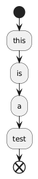

# Attached Image

This is a test.



And this is plantuml.

```plantuml
[*] --> State1
State1 --> [*]
State1 : this is my string
State1 : this is another string

State1 -> State2
State2 --> [*]
```
