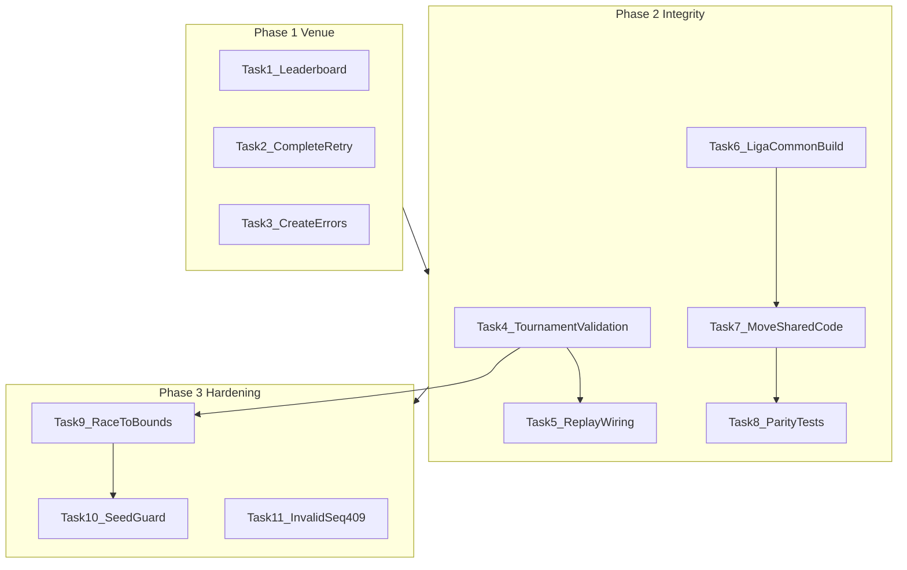

# Implementation Plan: Liga Thermo-Review Remediation

## Overview

Close thermo-audit gaps so Liga is **venue-correct** after tournament completion and **integrity-safe** under event-sourced replay, with a single shared handicap implementation across JVM and JS. Scope is remediation only — no new features, no performance work, no second-tournament-in-session flow.

**Source:** [SPEC.md](../SPEC.md) (approved 2026-07-12)

**Current state (read-only audit):** All SPEC success criteria are unchecked. [`ServeContext.scala`](../liga/src/main/scala/ph/samson/atbp/liga/serve/ServeContext.scala) still prefers `frozenRatings` over period files; [`completeTournament`](../liga/src/main/scala/ph/samson/atbp/liga/serve/ServeContext.scala) always writes then appends with no verify-and-skip retry; create errors use generic 400 text; no [`TournamentValidation.scala`](../liga/src/main/scala/ph/samson/atbp/liga/tournament/TournamentValidation.scala); no `liga-common` module in [`build.sbt`](../build.sbt); `0.75` handicap cap duplicated in 4+ source files.

## Architecture Decisions

- **Complete ordering:** Keep period-write-then-append; on retry, verify existing period file content via `PeriodEmission.toPeriod`, 409 on mismatch, skip write and append event on match (SPEC Resolved Decision #1).
- **Validation unification:** Extract pure `Either` validators into `TournamentValidation` callable from command handlers (`Tournament`, `Seed`) and [`Replay.scala`](../liga/src/main/scala/ph/samson/atbp/liga/tournament/Replay.scala) — replay must not be weaker than commands.
- **`liga-common`:** New JVM+JS crossProject for shared math (`Handicap`, `WinProbability`, `Tuning`) and types (`Player`, `PlayerRating`, `HandicapSuggestion`). Requires `sbt --batch` after `build.sbt` / `project/` edits per [AGENTS.md](../AGENTS.md).
- **HTTP error mapping:** Introduce distinct error types or `catchSome` patterns in [`DirectorRoutes.scala`](../liga/src/main/scala/ph/samson/atbp/liga/serve/DirectorRoutes.scala) — dir collision and `InvalidSeq` → 409; incomplete-tournament block → 400 with spec message.
- **Seed API contract:** `Seed.validateState` will require `TournamentPhase.raceToComplete` — update [`WriteApiSpec`](../liga/src/test/scala/ph/samson/atbp/liga/serve/WriteApiSpec.scala) seed test that currently passes inline `roundRaceTo` without prior `/race-to` steps.

## Dependency Graph

---

## Phase 1: Venue Correctness

### Task 1: Leaderboard after complete

**Description:** When `state.completed`, [`loadLeaderboard`](../liga/src/main/scala/ph/samson/atbp/liga/serve/ServeContext.scala) must load from `PeriodLoader.loadAll(dataDir)` instead of `frozenRatings`.

**Acceptance criteria:**
- [ ] `loadLeaderboard` branches on `state.completed` (not merely `frozenRatings.nonEmpty`)
- [ ] Seeded-but-incomplete tournaments still serve frozen ratings
- [ ] `ReadApiSpec` proves `GET /api/leaderboard` returns post-tournament ratings after HTTP complete

**Verification:**
- `sbt --client "liga/testOnly *ReadApiSpec*"`
- `sbt --client "liga/testOnly *EndToEndSpec*"`

**Dependencies:** None | **Scope:** S (2 files)

**Files:** [`ServeContext.scala`](../liga/src/main/scala/ph/samson/atbp/liga/serve/ServeContext.scala), [`ReadApiSpec.scala`](../liga/src/test/scala/ph/samson/atbp/liga/serve/ReadApiSpec.scala)

---

### Task 2: Complete idempotent retry

**Description:** Implement verify-and-skip logic in `completeTournament` per SPEC pseudocode: build expected period via `PeriodEmission.toPeriod`; if file exists, compare content → 409 mismatch / skip write + append on match; else write then append.

**Acceptance criteria:**
- [ ] Retry after successful period write + failed append completes tournament (event appended, state `completed`)
- [ ] Mismatched existing period file returns 409 (not generic 500)
- [ ] Matching existing period file does not overwrite (immutability preserved)
- [ ] `WriteApiSpec` or `ServeCheckpointSpec` simulates append failure then successful retry

**Verification:**
- `sbt --client "liga/testOnly *WriteApiSpec*"`
- `sbt --client "liga/testOnly *ServeCheckpointSpec*"`

**Dependencies:** None | **Scope:** M (3–4 files)

**Files:** [`ServeContext.scala`](../liga/src/main/scala/ph/samson/atbp/liga/serve/ServeContext.scala), [`PeriodEmission.scala`](../liga/src/main/scala/ph/samson/atbp/liga/tournament/PeriodEmission.scala), [`WriteApiSpec.scala`](../liga/src/test/scala/ph/samson/atbp/liga/serve/WriteApiSpec.scala), optionally [`ServeCheckpointSpec.scala`](../liga/src/test/scala/ph/samson/atbp/liga/serve/ServeCheckpointSpec.scala)

---

### Task 3: Create error messaging and dir collision 409

**Description:** Distinguish incomplete-tournament block from completed-dir collision; map collision to 409 with actionable message.

**Acceptance criteria:**
- [ ] `Resume.resolve` non-empty → `"an incomplete tournament already exists; resume or remove it first"` (400)
- [ ] Existing `tournament-YYYYMMDD-slug` dir (post-restart) → 409 with message to pick a different name
- [ ] `WriteApiSpec` covers both scenarios

**Verification:**
- `sbt --client "liga/testOnly *WriteApiSpec*"`

**Dependencies:** None | **Scope:** M (3 files)

**Files:** [`ServeContext.scala`](../liga/src/main/scala/ph/samson/atbp/liga/serve/ServeContext.scala), [`DirectorRoutes.scala`](../liga/src/main/scala/ph/samson/atbp/liga/serve/DirectorRoutes.scala), [`WriteApiSpec.scala`](../liga/src/test/scala/ph/samson/atbp/liga/serve/WriteApiSpec.scala)

---

### Checkpoint: Phase 1

- [ ] `sbt --client "liga/test"` passes for serve specs
- [ ] Director can complete tournament; audience leaderboard shows updated ratings
- [ ] Complete retry and create-collision paths verified in tests

---

## Phase 2: Event-Log Integrity + Shared Math

### Task 4: Extract TournamentValidation

**Description:** Create [`TournamentValidation.scala`](../liga/src/main/scala/ph/samson/atbp/liga/tournament/TournamentValidation.scala) with pure `Either` validators extracted from [`Tournament.scala`](../liga/src/main/scala/ph/samson/atbp/liga/tournament/Tournament.scala) (scores, handicap bounds, duplicate players) and [`Seed.scala`](../liga/src/main/scala/ph/samson/atbp/liga/tournament/Seed.scala) preconditions. Refactor command handlers to delegate — no behavior change yet.

**Acceptance criteria:**
- [ ] `validateMatchResult`, `validateHandicap`, `validatePlayersSet`, `validateSeedState` (or equivalent) exist as public pure functions
- [ ] `Tournament` / `Seed` call shared validators; existing `TournamentSpec` / `WriteApiSpec` still pass

**Verification:**
- `sbt --client "liga/testOnly *TournamentSpec*"`
- `sbt --client "liga/testOnly *WriteApiSpec*"`

**Dependencies:** Checkpoint Phase 1 | **Scope:** M (3–4 files)

---

### Task 5: Replay validation wiring + negative tests

**Description:** Wire [`Replay.scala`](../liga/src/main/scala/ph/samson/atbp/liga/tournament/Replay.scala) through `TournamentValidation` for `MatchResult`, `HandicapApplied`, `PlayersSet`, `BracketSeeded`. Add negative `ReplaySpec` cases that write corrupt events directly to disk.

**Acceptance criteria:**
- [ ] Replay rejects invalid scores (winner ≠ race-to, loser ≥ race-to)
- [ ] Replay rejects handicap outside `0 … floor(0.75 × race-to)`
- [ ] Replay rejects duplicate player names on `PlayersSet`
- [ ] Replay rejects `BracketSeeded` without seed preconditions
- [ ] All negative cases in `ReplaySpec` bypass HTTP

**Verification:**
- `sbt --client "liga/testOnly *ReplaySpec*"`

**Dependencies:** Task 4 | **Scope:** M (2–3 files)

---

### Task 6: liga-common crossProject build setup

**Description:** Add `liga-common` JVM+JS crossProject to [`build.sbt`](../build.sbt) and [`project/Dependencies.scala`](../project/Dependencies.scala). Wire `liga` and `ligaJs` to depend on it. Use `sbt --batch compile` after build-definition edits.

**Acceptance criteria:**
- [ ] `liga-common/` directory exists with crossProject structure
- [ ] `liga` and `ligaJs` compile against empty/skeleton common module
- [ ] Root aggregate includes common subprojects

**Verification:**
- `sbt --batch compile`
- `sbt --batch fixup && git status` (clean)

**Dependencies:** Checkpoint Phase 1 | **Scope:** M (build files only)

---

### Task 7: Move shared math and types; delete JS duplicates

**Description:** Move `Handicap`, `WinProbability`, `Tuning`, and shared model types into `liga-common`. Update JVM/JS imports. Delete [`liga-js/.../glicko/`](../liga-js/src/main/scala/ph/samson/atbp/liga/js/glicko/) duplicates; point [`MatchPanel.scala`](../liga-js/src/main/scala/ph/samson/atbp/liga/js/director/MatchPanel.scala) at shared code. Define `HandicapCap` constant once (replace `0.75` literals in handicap/tournament/guidance code).

**Acceptance criteria:**
- [ ] No duplicated `HandicapPreview.scala` / `WinProbability.scala` / `Tuning.scala` in `liga-js`
- [ ] `0.75` race-to factor defined once in shared code
- [ ] Director handicap preview uses shared implementation
- [ ] `liga` and `ligaJs` compile and existing tests pass

**Verification:**
- `sbt --client "liga/testOnly *Handicap*"`
- `sbt --client compile`

**Dependencies:** Task 6 | **Scope:** L (8+ files — implement as one focused move, not refactor sprawl)

---

### Task 8: JS parity tests

**Description:** Add real `liga-js` test target with at least one parity spec comparing handicap preview output to JVM for a representative fixture.

**Acceptance criteria:**
- [ ] `liga-js/src/test/` exists with test dependencies in `Dependencies.scala`
- [ ] `sbt --client "liga-js/test"` runs and passes
- [ ] Relocate or replace misplaced [`HandicapPreviewParitySpec`](../liga/src/test/scala/ph/samson/atbp/liga/js/HandicapPreviewParitySpec.scala) in `liga` (currently tests JVM only)

**Verification:**
- `sbt --client "liga-js/test"`

**Dependencies:** Task 7 | **Scope:** S (2–3 files)

---

### Checkpoint: Phase 2

- [ ] `ReplaySpec` negative cases pass
- [ ] `liga-js/test` passes
- [ ] No `0.75` literals outside shared `HandicapCap` (except CSS in `DirectorApp`)

---

## Phase 3: API Hardening

### Task 9: Race-to bounds (`raceTo < 2`)

**Description:** Reject `raceTo < 2` in `Tournament.setRoundRaceTo`, `Seed.buildEvents`, and replay `RoundRaceToSet` fold via `TournamentValidation`. Add `WizardError` variant for invalid race-to.

**Acceptance criteria:**
- [ ] `setRoundRaceTo` with `raceTo < 2` fails with typed error
- [ ] `Seed.buildEvents` rejects invalid race-to in map
- [ ] Replay rejects invalid `RoundRaceToSet` events
- [ ] `TournamentSpec` and `SeedSpec` cover bounds

**Verification:**
- `sbt --client "liga/testOnly *TournamentSpec*"`
- `sbt --client "liga/testOnly *SeedSpec*"`

**Dependencies:** Task 4 | **Scope:** M (4–5 files)

---

### Task 10: Seed raceToComplete guard

**Description:** Add `TournamentPhase.raceToComplete(state)` check to `Seed.validateState`. Update `WriteApiSpec` wizard flow if inline `roundRaceTo` on seed is no longer valid.

**Acceptance criteria:**
- [ ] Seeding without all required round race-to values fails
- [ ] `SeedSpec` proves rejection
- [ ] Happy-path wizard (set race-to per round, then seed) still passes in `WriteApiSpec`

**Verification:**
- `sbt --client "liga/testOnly *SeedSpec*"`
- `sbt --client "liga/testOnly *WriteApiSpec*"`

**Dependencies:** Task 9 | **Scope:** S (2–3 files)

---

### Task 11: InvalidSeq → HTTP 409

**Description:** Map `EventLog.InvalidSeq` to 409 with retryable message in `DirectorRoutes.directorOnly` (not generic 500 via `catchAll`).

**Acceptance criteria:**
- [ ] Stale-seq write returns 409 with message indicating retry
- [ ] `WriteApiSpec` proves 409 not 500

**Verification:**
- `sbt --client "liga/testOnly *WriteApiSpec*"`

**Dependencies:** Checkpoint Phase 2 | **Scope:** S (2 files)

---

### Checkpoint: Complete

- [ ] `sbt --client "liga/test"` passes
- [ ] `sbt --client "liga-js/test"` passes
- [ ] `sbt --client fixup && git status` clean
- [ ] `EndToEndSpec` eight- and sixteen-player flows pass unchanged
- [ ] All SPEC required success criteria checked off

---

## Optional (time permitting — not blocking PR)

- Extract inline CSS from `DirectorApp.scala` to static asset
- Fix `BracketLayout.roundOf("gf-1")` display semantics
- Cache `fastLinkJS` in `resourceGenerators`
- Block `director.js` on non-loopback in `--lan` mode

---

## Risks and Mitigations

| Risk | Impact | Mitigation |
|------|--------|------------|
| `liga-common` build breakage | High | Use `sbt --batch` for build edits; compile both JVM and JS before moving code |
| Seed guard breaks inline `roundRaceTo` API | Med | Update `WriteApiSpec` and verify wizard UI still sets race-to before seed |
| Complete retry content comparison fragile | Med | Compare canonical `PeriodEmission.toPeriod` output; reuse `PeriodCodec` if available |
| Large `liga-common` move touches many imports | Med | Move in one commit slice; run full test suite before Phase 3 |

## Open Questions

None — SPEC marked approved with all decisions resolved (2026-07-12).
