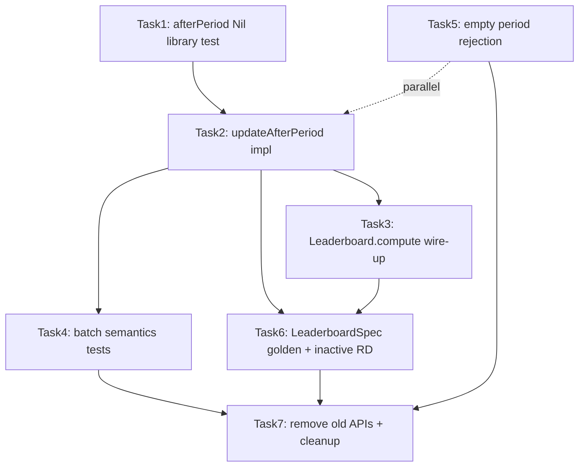

# Implementation Plan: Liga Batch Period Ratings

## Overview

The `liga` module currently folds matches sequentially inside each period file ([`Leaderboard.scala`](../liga/src/main/scala/ph/samson/atbp/liga/glicko/Leaderboard.scala) line 10), which makes ratings order-dependent and skips RD inflation for inactive players. This plan implements [`SPEC.md`](../SPEC.md): one Glicko2 rating period per `.liga` file via `Glicko2.updateAfterPeriod`, with `Leaderboard.compute` calling it once per period and all match-level update APIs removed.

## Current State

| Component | Status |
|-----------|--------|
| [`Glicko2.scala`](../liga/src/main/scala/ph/samson/atbp/liga/glicko/Glicko2.scala) | Has `updateAfterMatch` / `updateAfterGame`; no `updateAfterPeriod` |
| [`Leaderboard.scala`](../liga/src/main/scala/ph/samson/atbp/liga/glicko/Leaderboard.scala) | Inner `period.matches.foldLeft(state)(Glicko2.updateAfterMatch)` |
| [`PeriodCodec.scala`](../liga/src/main/scala/ph/samson/atbp/liga/io/PeriodCodec.scala) | Accepts `matches = []` silently |
| [`Glicko2Spec.scala`](../liga/src/test/scala/ph/samson/atbp/liga/glicko/Glicko2Spec.scala) | Tests `updateAfterMatch` / `updateAfterGame` |
| [`LeaderboardSpec.scala`](../liga/src/test/scala/ph/samson/atbp/liga/glicko/LeaderboardSpec.scala) | Does not exist |
| Golden fixtures | [`2026-01-10.liga`](../liga/src/test/resources/period-loader/golden/2026-01-10.liga) (Alice beats Bob 7-4), [`2026-03-15.liga`](../liga/src/test/resources/period-loader/golden/2026-03-15.liga) (Carol beats Alice 4-7) |

## Architecture Decisions

- **One `.liga` file = one Glicko2 rating period** — opponent ratings frozen at period-start snapshot; all games batched into one `afterPeriod` call per player.
- **Inactive players** — every `priorSnapshot` key who didn't play gets `afterPeriod(Nil)`; W-L unchanged, RD/volatility advance.
- **Debut players** — new `InternalRating` entry, then one `afterPeriod` with their results; no prior inactive pass.
- **Empty periods rejected at load** — `PeriodCodec.toPeriod` fails when `matches.isEmpty` (not silent inactive-update-all).
- **Reuse [`ScoreExpansion.expandGames`](../liga/src/main/scala/ph/samson/atbp/liga/model/ScoreExpansion.scala)** — same per-game expansion, but opponent `GlickoPlayer` values always come from frozen `priorSnapshot`.
- **No new dependencies, no format changes** — `Tuning.Default`, `dimos.glicko2` 1.0.1, tournament `frozenRatings` untouched.

## Dependency Graph



## Task List

### Phase 1: Foundation

#### Task 1: Validate `afterPeriod(Nil)` library semantics

**Description:** Add a direct `dimos.glicko2.Player.afterPeriod(Nil)` test in `Glicko2Spec` before wiring inactive-player logic. Confirms assumption that RD rises and rating stays stable.

**Acceptance criteria:**
- [ ] New test calls `GlickoPlayer(...).afterPeriod(Nil, Tuning.Default)` directly
- [ ] Asserts rating unchanged (within `approx`), RD increased, volatility finite

**Verification:**
- `sbt --client "liga/testOnly *Glicko2*"`

**Dependencies:** None

**Files likely touched:**
- [`liga/src/test/scala/ph/samson/atbp/liga/glicko/Glicko2Spec.scala`](../liga/src/test/scala/ph/samson/atbp/liga/glicko/Glicko2Spec.scala)

**Estimated scope:** S (1 file)

---

#### Task 2: Implement `Glicko2.updateAfterPeriod`

**Description:** Add the sole rating-update entry point with scaladoc stating the order-independence invariant. Algorithm per SPEC: freeze `priorSnapshot`, collect `Seq[Result]` per player using period-start opponent ratings, update all prior players (played or inactive), handle debuts, return full snapshot.

**Acceptance criteria:**
- [ ] `def updateAfterPeriod(priorSnapshot: Snapshot, period: Period): Snapshot` exists with invariant scaladoc
- [ ] Single-match period produces correct W-L and ratings (migrate existing 7-4 test)
- [ ] Debut players get `newInternal` + one `afterPeriod`
- [ ] Prior inactive players get `afterPeriod(Nil)` with unchanged W-L

**Verification:**
- `sbt --client "liga/testOnly *Glicko2*"`
- `sbt --client compile`

**Dependencies:** Task 1

**Files likely touched:**
- [`liga/src/main/scala/ph/samson/atbp/liga/glicko/Glicko2.scala`](../liga/src/main/scala/ph/samson/atbp/liga/glicko/Glicko2.scala)
- [`liga/src/test/scala/ph/samson/atbp/liga/glicko/Glicko2Spec.scala`](../liga/src/test/scala/ph/samson/atbp/liga/glicko/Glicko2Spec.scala)

**Estimated scope:** M (2 files)

### Checkpoint: Foundation
- [ ] `updateAfterPeriod` compiles and single-match tests pass
- [ ] `afterPeriod(Nil)` library test passes
- [ ] Review algorithm against SPEC steps 1-5 before proceeding

---

### Phase 2: Integration

#### Task 3: Wire `Leaderboard.compute`

**Description:** Replace the inner match fold with a single `updateAfterPeriod` call per period.

**Target shape:**

```scala
periods.foldLeft(Glicko2.empty) { (state, period) =>
  Glicko2.updateAfterPeriod(state, period)
}
```

**Acceptance criteria:**
- [ ] No `matches.foldLeft` in `Leaderboard.compute`
- [ ] `PeriodLoaderSpec` golden self-consistency test still passes (`ratings == Leaderboard.compute(...)`)

**Verification:**
- `sbt --client "liga/testOnly *PeriodLoader*"`

**Dependencies:** Task 2

**Files likely touched:**
- [`liga/src/main/scala/ph/samson/atbp/liga/glicko/Leaderboard.scala`](../liga/src/main/scala/ph/samson/atbp/liga/glicko/Leaderboard.scala)

**Estimated scope:** XS (1 file)

---

#### Task 4: Batch semantics and order-independence tests

**Description:** Add `Glicko2Spec` tests for multi-match periods: multi-opponent batching, rematch within period (same opponent at period-start rating), and a property test shuffling `period.matches` yields identical snapshot.

**Acceptance criteria:**
- [ ] Alice beats Bob 7-4 and loses to Carol 4-7 in one period → one batch update
- [ ] Two matches vs same opponent both reference period-start opponent μ/φ
- [ ] `Random.shuffle(period.matches)` → identical snapshot (within `approx`)

**Verification:**
- `sbt --client "liga/testOnly *Glicko2*"`

**Dependencies:** Task 2

**Files likely touched:**
- [`liga/src/test/scala/ph/samson/atbp/liga/glicko/Glicko2Spec.scala`](../liga/src/test/scala/ph/samson/atbp/liga/glicko/Glicko2Spec.scala)

**Estimated scope:** S (1 file)

### Checkpoint: Core batch semantics
- [ ] Order-independence property test passes
- [ ] Multi-match scenarios pass
- [ ] `Leaderboard.compute` integration works end-to-end

---

### Phase 3: Edge Cases and Golden Fixtures

#### Task 5: Reject empty period files at load time

**Description:** Fail in `PeriodCodec.toPeriod` when `config.matches.isEmpty` with a clear error message. Add test fixture and `PeriodLoaderSpec` case.

**Acceptance criteria:**
- [ ] `.liga` file with `matches = []` fails `PeriodCodec.parseFile` / `PeriodLoader.discover`
- [ ] Error message is descriptive (mentions zero matches)

**Verification:**
- `sbt --client "liga/testOnly *PeriodLoader*"`

**Dependencies:** None (can run in parallel with Tasks 2-4)

**Files likely touched:**
- [`liga/src/main/scala/ph/samson/atbp/liga/io/PeriodCodec.scala`](../liga/src/main/scala/ph/samson/atbp/liga/io/PeriodCodec.scala)
- [`liga/src/test/scala/ph/samson/atbp/liga/io/PeriodLoaderSpec.scala`](../liga/src/test/scala/ph/samson/atbp/liga/io/PeriodLoaderSpec.scala)
- `liga/src/test/resources/period-loader/empty/empty.liga` (new fixture)

**Estimated scope:** S (3 files)

---

#### Task 6: `LeaderboardSpec` with golden values and inactive RD regression

**Description:** Create new `LeaderboardSpec` with commented numeric expected ratings for the golden fixture (Alice, Bob, Carol across two periods). Canonical regression: Bob's RD increases in period 2 despite not playing; W-L unchanged.

**Acceptance criteria:**
- [ ] New `LeaderboardSpec.scala` loads golden fixture via `PeriodLoader`
- [ ] Hard-coded expected rating/RD/W-L values with comments explaining batch semantics
- [ ] Bob's RD after period 2 > Bob's RD after period 1; Bob W-L unchanged
- [ ] `PeriodLoaderSpec` golden test reduced to self-consistency only (no duplicate numeric assertions)

**Verification:**
- `sbt --client "liga/testOnly *Leaderboard*"`
- `sbt --client "liga/testOnly *PeriodLoader*"`

**Dependencies:** Tasks 3, 4

**Files likely touched:**
- `liga/src/test/scala/ph/samson/atbp/liga/glicko/LeaderboardSpec.scala` (new)
- [`liga/src/test/scala/ph/samson/atbp/liga/io/PeriodLoaderSpec.scala`](../liga/src/test/scala/ph/samson/atbp/liga/io/PeriodLoaderSpec.scala)

**Estimated scope:** M (2 files)

### Checkpoint: Fixtures and edge cases
- [ ] Golden expected values documented and passing
- [ ] Empty period rejection works
- [ ] Bob inactive RD inflation verified

---

### Phase 4: Cleanup

#### Task 7: Remove deprecated APIs and finalize tests

**Description:** Delete `updateAfterMatch` and `updateAfterGame` from `Glicko2`. Migrate remaining `Glicko2Spec` tests (golden wrapper, properties) to use `Period` + `updateAfterPeriod`. Run full suite and fixup.

**Acceptance criteria:**
- [ ] `updateAfterMatch` and `updateAfterGame` removed from public API
- [ ] No references to removed methods in codebase
- [ ] Existing golden vector tests (direct library calls) preserved
- [ ] `sbt --client "liga/test"` passes
- [ ] `sbt --client fixup && git status` clean

**Verification:**
```bash
sbt --client "liga/testOnly *Glicko2*"
sbt --client "liga/testOnly *PeriodLoader*"
sbt --client "liga/testOnly *Leaderboard*"
sbt --client "liga/test"
git add -A && sbt --client fixup && git status
```

**Dependencies:** Tasks 4, 5, 6

**Files likely touched:**
- [`liga/src/main/scala/ph/samson/atbp/liga/glicko/Glicko2.scala`](../liga/src/main/scala/ph/samson/atbp/liga/glicko/Glicko2.scala)
- [`liga/src/test/scala/ph/samson/atbp/liga/glicko/Glicko2Spec.scala`](../liga/src/test/scala/ph/samson/atbp/liga/glicko/Glicko2Spec.scala)

**Estimated scope:** M (2 files)

### Checkpoint: Complete
- [ ] All SPEC acceptance criteria met
- [ ] Full test suite green
- [ ] Working tree clean after fixup
- [ ] Ready for human review / commit

## Parallelization Opportunities

| Can parallelize | Must be sequential |
|-----------------|-------------------|
| Task 5 (empty period rejection) alongside Tasks 2-4 | Task 2 before 3, 4, 6 |
| Task 4 test writing while Task 3 is a one-liner | Task 7 after all behavior is proven |

## Risks and Mitigations

| Risk | Impact | Mitigation |
|------|--------|------------|
| `afterPeriod(Nil)` semantics differ from expectation | High | Task 1 validates library directly before wiring |
| Golden fixture numeric values hard to derive | Med | Compute once via REPL/test println, document in comments |
| W-L counting wrong across multi-match batch | Med | Explicit per-match score accumulation tests in Task 4 |
| Scalafmt second-pass drift | Low | Follow AGENTS.md fixup + git status loop |

## Open Questions

None — all decisions resolved in SPEC (empty periods rejected, golden values in `LeaderboardSpec`, W-L unchanged for inactive players).
